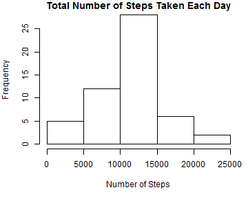
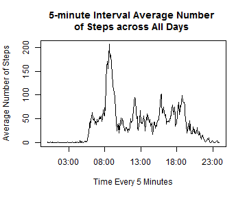
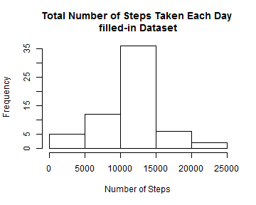
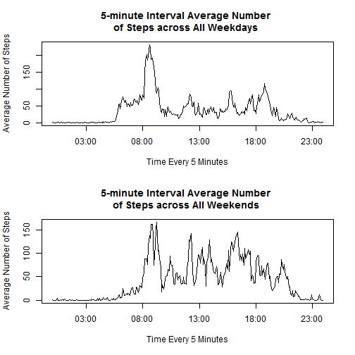

Reproducible Research - Peer Assessment 1
========================================================

## Loading and preprocessing the data
First of all, we need to obtain the data file from its [source](https://d396qusza40orc.cloudfront.net/repdata%2Fdata%2Factivity.zip). Since it is a zip file, extract it and save it in a **./data** folder. Then, set your working directory appropriately.

To load the data **./data/activity.csv**:


```r
# Read data using read.csv()
activity <- read.csv("./data/activity.csv", colClasses = c("numeric", "character", 
    "numeric"))
```


To preprocess the data:


```r
# Format date column into 'Date' class
activity$date <- as.Date(activity$date, format = "%Y-%m-%d")
# Better format for interval
activity$interval <- sprintf("%02d:%02d", activity$interval%/%100, activity$interval%%100)
activity$datetime <- paste(activity$date, activity$interval)
# Subset data without NA values for next steps in the assignment
activitySub <- activity[complete.cases(activity), ]
# Use appropriate format of date and time
activitySub$datetime <- strptime(activitySub$datetime, "%Y-%m-%d %H:%M")
# Use str
str(activitySub)
```

```
## 'data.frame':	15264 obs. of  4 variables:
##  $ steps   : num  0 0 0 0 0 0 0 0 0 0 ...
##  $ date    : Date, format: "2012-10-02" "2012-10-02" ...
##  $ interval: chr  "00:00" "00:05" "00:10" "00:15" ...
##  $ datetime: POSIXlt, format: "2012-10-02 00:00:00" "2012-10-02 00:05:00" ...
```


## What is mean total number of steps taken per day?
Create a summary of the total number of steps taken per day using *ddply* from the *plyr* package.


```r
library(plyr)
activitySubperDay <- ddply(activitySub, .(date), summarize, stepsday = sum(steps))
```


* Plot the histogram of the total number of steps taken each day:


```r
par(mar = c(5, 4, 1, 1))
hist(activitySubperDay$stepsday, main = "Total Number of Steps Taken Each Day", 
    xlab = "Number of Steps")
```

 


* Calculate and report the mean and median total number of steps taken per day


```r
meanStepsDay <- mean(activitySubperDay$stepsday)
medianStepsDay <- median(activitySubperDay$stepsday)
```


The mean of the total number of steps taken per day is 1.0766 &times; 10<sup>4</sup> while the median is 1.0765 &times; 10<sup>4</sup>.


## What is the average daily activity pattern?

To tackle this question the following is created:

* a time series plot (i.e. type = "l") of the 5-minute interval (x-axis) and the average number of steps taken, averaged across all days (y-axis)

First let's create the variables to be plotted


```r
library(plyr)
ave_steps_day <- ddply(activitySub, .(interval), summarize, ave_stepsday = mean(steps))
x_time <- as.POSIXct(ave_steps_day$interval, format = "%H:%M")
y_axis <- ave_steps_day$ave_stepsday
```


Now, let's plot them


```r
plot(x_time, y_axis, type = "l", main = "5-minute Interval Average Number \nof Steps across All Days ", 
    xlab = "Time Every 5 Minutes", ylab = "Average Number of Steps")
```

 


* Which 5-minute interval, on average across all the days in the dataset, contains the maximum number of steps?


```r
MaxNoSteps <- ave_steps_day$interval[which.max(ave_steps_day$ave_stepsday)]
```


The maximum number of steps is at 08:35.

## Imputing missing values

There are a number of days/intervals where there are missing values (coded as NA).

Calculate and report the total number of missing values in the dataset (i.e. the total number of rows with NAs)


```r
ok <- complete.cases(activity)
NMissingValues <- sum(!ok)
```


There are 2304  rows with NAs in the original **activity** data set.

### Filling in values

Since any strategy is possible, and missing values correspond to a full day at each time, to perform this task, the *average of the number of steps across all days* is used to carry out this task.

The new data set with NAs filled in is called *activity_new*.


```r
activity_new <- activity
activity_new$steps[!ok] <- ave_steps_day$ave_stepsday
```


```r
library(plyr)
activity_newperDay <- ddply(activity_new, .(date), summarize, stepsday = sum(steps))
```


* Plot the histogram of the total number of steps taken each day for the *activity_new* data:


```r
hist(activity_newperDay$stepsday, main = "Total Number of Steps Taken Each Day \nfilled-in Dataset", 
    xlab = "Number of Steps")
```

 


* Calculate and report the mean and median total number of steps taken per day in *activity_new*.


```r
meanStepsDay_new <- mean(activity_newperDay$stepsday)
medianStepsDay_new <- median(activity_newperDay$stepsday)
```


The mean of the total number of steps taken per day after fixing missing values is 1.0766 &times; 10<sup>4</sup> while the median is 1.0766 &times; 10<sup>4</sup>.

#### Discussion
Do these values differ from the estimates from the first part of the assignment? What is the impact of imputing missing data on the estimates of the total daily number of steps?

Let's calculate the mean and median differences in both cases.


```r
percentage_difmean <- abs(meanStepsDay_new - meanStepsDay)/meanStepsDay * 100
percentage_difmedian <- abs(medianStepsDay_new - medianStepsDay)/meanStepsDay * 
    100
```

We can notice from the above computations and results that the mean and median when missing values were omitted almost did not change when missing values were filled in for the average number of steps across all days with a variation of 0% for the mean, and 0.011% for the median.Thus, we can see that the imputation method was adequate.


## Are there differences in activity patterns between weekdays and weekends?

For this part.

* Create a new factor variable with two levels - "weekday" and "weekend".


```r
activity_new$weekday <- weekdays(activity_new$date)
idx_weekend <- activity_new$weekday == "Saturday" | activity_new$weekday == 
    "Sunday"
activity_new$wdaywend <- factor(idx_weekend, labels = c("weekday", "weekend"))
```


* Make a plot with the 5-minute interval (x-axis) and the average number of steps taken, averaged across all weekday days or weekend days (y-axis). 


```r
# subset weekday data
activity_new_weekday <- activity_new[activity_new$wdaywend == "weekday", ]
activity_new_weekend <- activity_new[activity_new$wdaywend == "weekend", ]

library(plyr)
steps_new_aveWday <- ddply(activity_new_weekday, .(interval), summarize, ave_stepsWeekday = mean(steps))
x_time_weekday <- as.POSIXct(steps_new_aveWday$interval, format = "%H:%M")
y_axis_weekday <- steps_new_aveWday$ave_stepsWeekday

steps_new_aveWend <- ddply(activity_new_weekend, .(interval), summarize, ave_stepsWeekend = mean(steps))
x_time_weekend <- as.POSIXct(steps_new_aveWend$interval, format = "%H:%M")
y_axis_weekend <- steps_new_aveWend$ave_stepsWeekend

par(mfrow = c(2, 1))
plot(x_time_weekday, y_axis_weekday, type = "l", main = "5-minute Interval Average Number \nof Steps across All Weekdays ", 
    xlab = "Time Every 5 Minutes", ylab = "Average Number of Steps")
plot(x_time_weekend, y_axis_weekend, type = "l", main = "5-minute Interval Average Number \nof Steps across All Weekends ", 
    xlab = "Time Every 5 Minutes", ylab = "Average Number of Steps")
```

 

